# 🚀 Automated Lead Capture (Webflow → Sheets → Slack → Email)

A real-time automation to save leads instantly, alert your team, and improve client response – built in [Make.com](https://www.make.com).

---

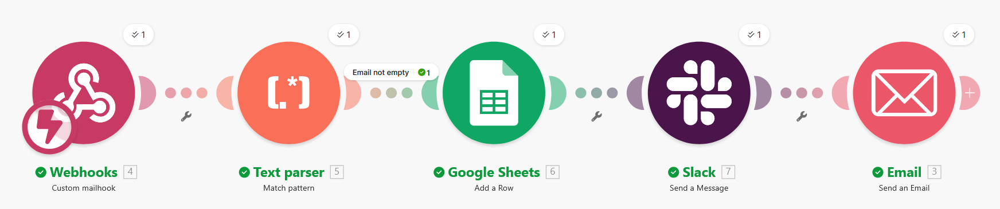

> **In 10 seconds:** A Webflow form submission triggers a Make mailhook, parses the email body, saves the lead to Google Sheets, posts to Slack, and sends an auto-reply email.

Built to ensure no lead gets missed.

## ✅ At a glance

- **Trigger:** Webflow form submission (via email → Make mailhook)
- **Actions:** Google Sheets row + Slack alert + instant confirmation email
- **Best for:** Solo founders, agencies, service businesses
- **Result:** Faster response + fewer missed inquiries

When a visitor submits the **Webflow** contact form, the workflow instantly:
1) parses the submission data,
2) stores the lead in **Google Sheets**,
3) alerts the team in **Slack**, and
4) sends an **instant confirmation email** to the lead.

---

## 📈 Impact

- **Response time:** instant (vs. manual follow-up later)
- **Data reliability:** every lead stored in one place (Sheets)
- **Team visibility:** Slack alert ensures no inquiry is missed

### Estimated ROI (example)

If a team receives ~10 leads/week and manual handling takes ~5 minutes per lead:

- **Time saved:** ~50 minutes/week (~3.3 hours/month)
- **Faster response:** instant confirmation + Slack alert
- **Lower risk:** every inquiry logged in Sheets

---

##  Table of Contents

- [Overview](#overview)
- [Client / Scenario](#client--scenario)
- [Who This Automation Helps (Industries that Benefit)](#who-this-automation-helps-industries-that-benefit)
- [Problem](#problem)
- [Solution (Workflow)](#solution-workflow)
- [Why This Automation Matters](#why-this-automation-matters)
- [Workflow Visuals – Supplementary Screenshots](#workflow-visuals--supplementary-screenshots)
- [Results / ROI](#results--roi)
- [Key Implementation Details (Behind the Scenes)](#key-implementation-details-behind-the-scenes)
- [What I’d Improve Next](#what-id-improve-next)
- [Notes on Privacy](#notes-on-privacy)
- [Tech Stack](#tech-stack)
- [Call to Action](#call-to-action)

---

##  Client / Scenario

This project simulates a typical Swedish small business (*småföretag*)—for example, a local cleaning or repair service with 2–3 employees.

These businesses often receive 5–10 inquiries per week via their Webflow contact form, but they lack time and tools to manage leads efficiently.

> This project simulates a typical Swedish small business (*småföretag*, meaning “micro-business” or “small local company”).

---

##  Who This Automation Helps (Industries that Benefit)

This automation is especially useful for small and digital businesses that rely on fast, consistent responses to online lead inquiries.  

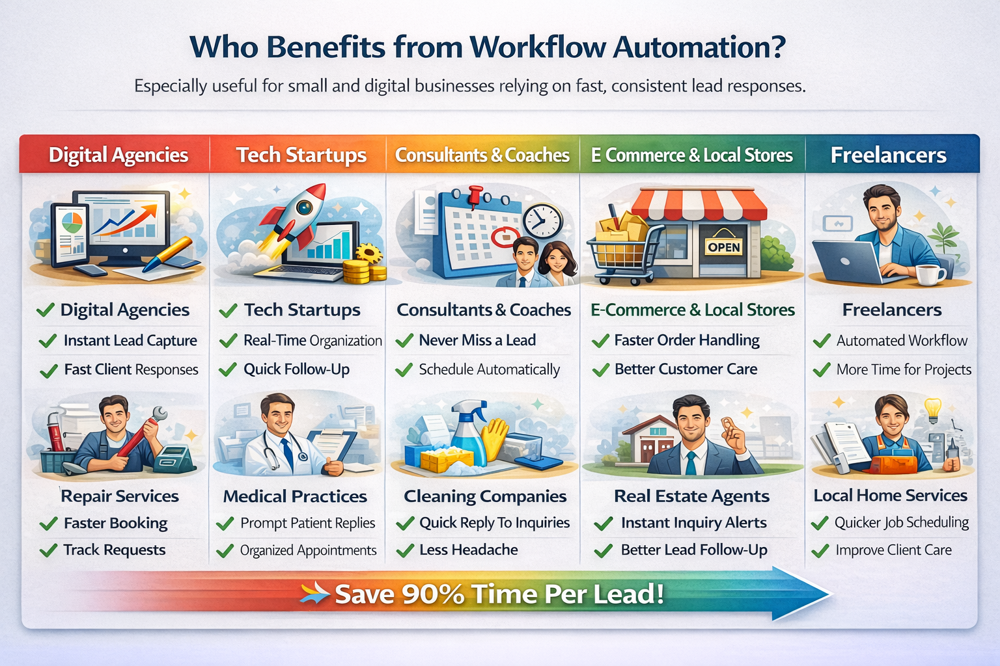

**Key industries that benefit most:**

- 💻 **Digital Agencies** – instant lead capture & fast client responses  
- 🚀 **Tech & SaaS Startups** – real-time lead organization and follow-up  
- 🧠 **Consultants & Coaches** – never miss a potential client  
- 🛒 **E‑commerce & Local Stores** – quicker order capture & customer care  
- ✨ **Freelancers & Service Providers** – professional and automated workflows

---

## Problem

Manual handling of contact form submissions often causes:
- missed leads (messages get buried in inboxes)
- slow response time (poor first impression)
- no centralized tracking (hard to follow up consistently)

---

## Solution (Workflow)

**Trigger:** Webflow contact form submission → Email notification → Make mailhook

**Automation steps:**
1. **Webhooks (Custom mailhook)** – receives the Webflow form email instantly  
2. **Text parser (Match pattern)** – extracts `name`, `email`, `message` from the email body  
3. **Google Sheets (Add a row)** – stores every lead (Timestamp, Name, Email, Message, Source)  
4. **Slack (Send a message)** – posts a new-lead alert in `#leads`  
5. **Email (Send an email)** – auto-reply confirmation to the lead

> **Filter:** `Email not empty` prevents invalid / empty submissions.

---

##  Workflow Visuals – Supplementary Screenshots

Here are reference screenshots from the actual automation scenario to visually explain each step in the lead automation process.

### 1.  Contact Form Submission  
**User fills out and submits the contact form on Webflow.**

📥 Filled-out form:  
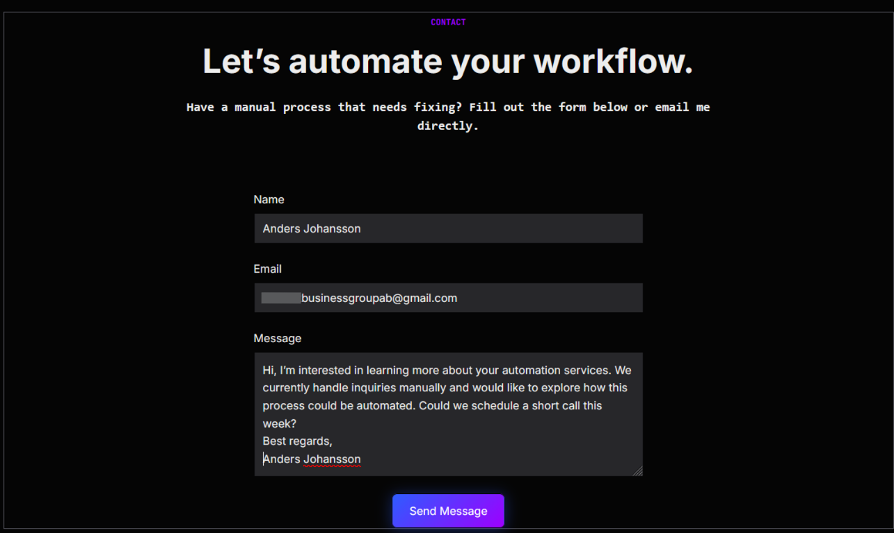

✅ Submission confirmation (Thank You message):  
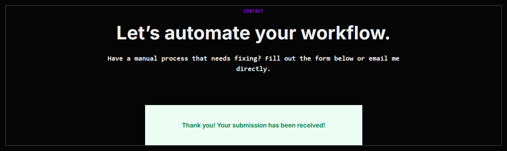
---

### 2. 📨 Webhook Captures Form Submission  
**Make.com webhook receives the new message from Webflow.**  
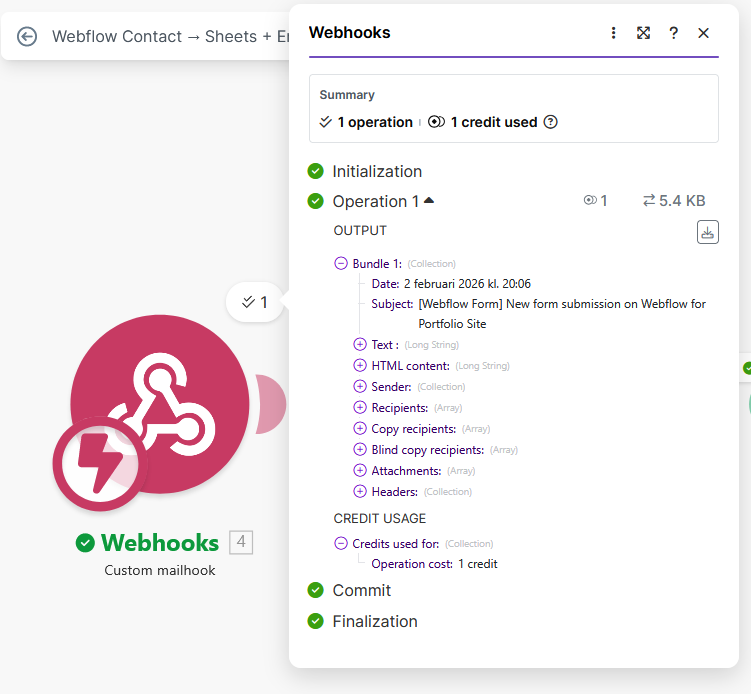

---

### 3. 🧠 Text Parser Extracts Lead Info  
**Name, email, and message are parsed from the submission.**  
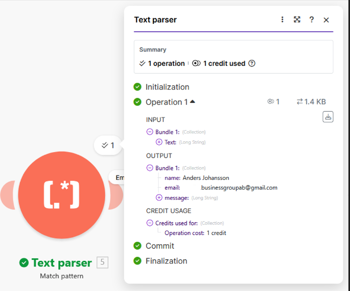

---

### 4. 🚦 Email Content Filter  
**Only non-empty messages continue in the flow.**  
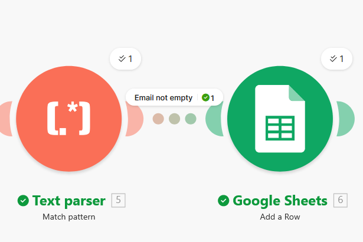

---

### 5. 📊 Save to Google Sheets  
**Lead data is recorded in a Google Sheets row.**  
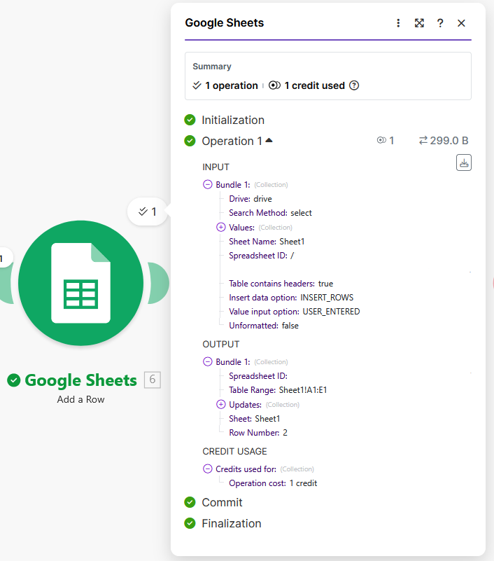

---

### 6. 📄 Sheet Entry Confirmation  
**The lead is stored with timestamp and source.**  
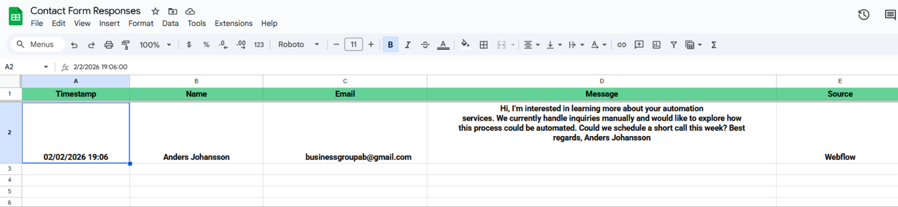

---

### 7. 🔔 Slack Notification  
**New lead details are sent to a Slack channel instantly.**  
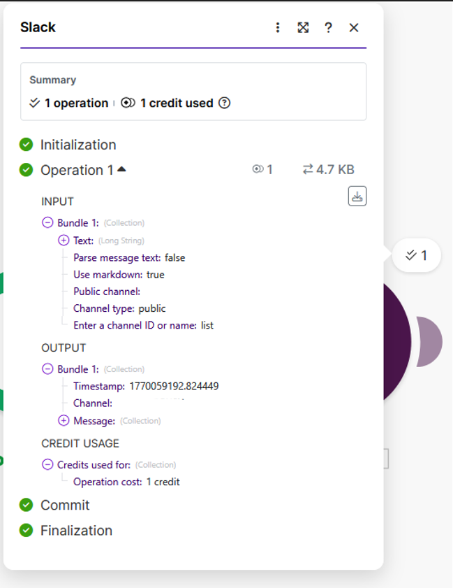

---

### 8. 📧 Confirmation Email Sent to Lead  
**Automated thank-you email is sent.**  
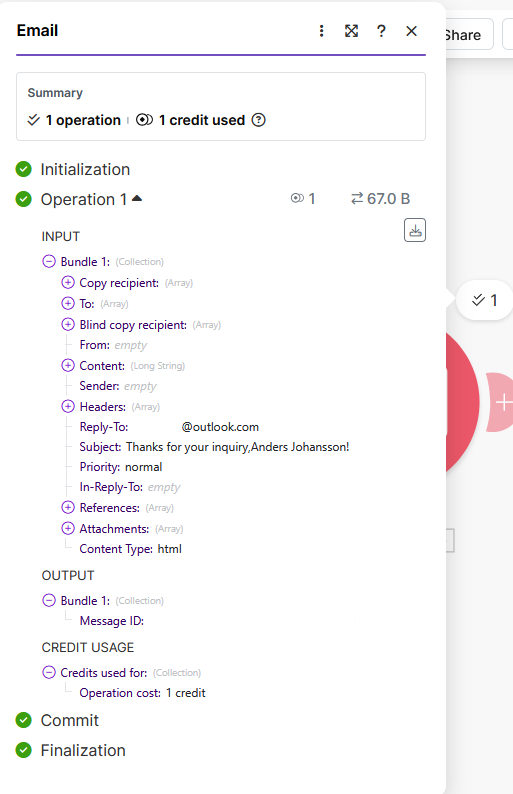

---

## 9. 🔔 Slack Notification in #leads
The team receives an instant Slack alert with the lead details.
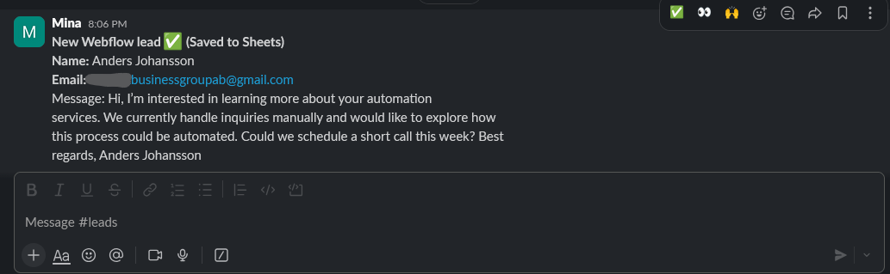

---

### 10. ✅ Lead Receives Confirmation Reply  
**Client sees the reply in their inbox.**  
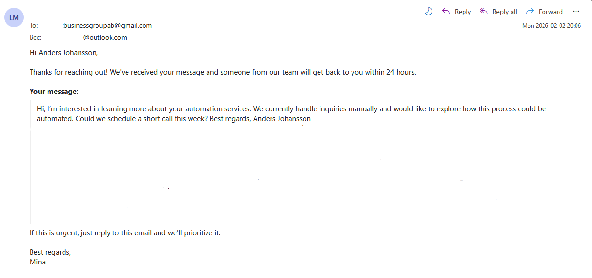

---

## How to test (quick demo)

Use a test email and dummy data (no real client data).

1. Submit the Webflow contact form with a test name/email/message.
2. Confirm a new row appears in Google Sheets.
3. Confirm a Slack message appears in `#leads`.
4. Confirm the auto-reply email arrives to the submitted email address.

---

###  Visual Scenario Overview

A step-by-step visual breakdown of the full automation process — from form submission to team notification.

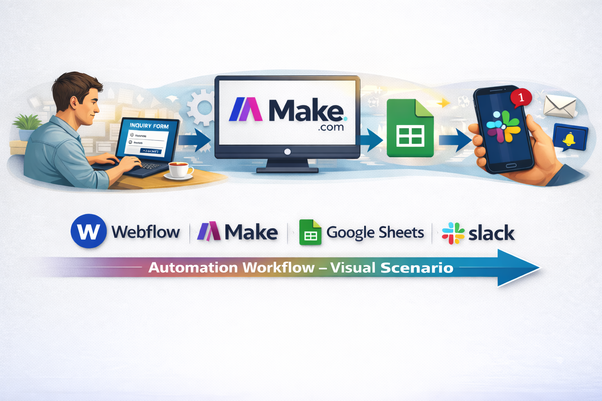

Form → Make → Google Sheets → Slack → Email — fully automated in seconds

---

##  Results / ROI

- ⏱️ **Instant confirmation** to the lead = better client experience  
- 📊 **All leads stored in one place** = easier tracking and follow-up  
- ⚡ **Real-time alerts** in Slack = faster response  
- 💼 **Less manual work** = fewer missed messages, more time for service  

---

##  Why This Automation Matters

Manual lead handling may seem manageable at first — but it often results in lost time, missed leads, and unnecessary stress.

This visual comparison shows how automation transforms your workflow into something faster, easier, and more reliable:

> Visual comparison (illustrative): highlights typical manual steps vs an automated pipeline.  
> Time ranges in the graphic are examples — the realistic estimate for this demo is shown in **Estimated ROI (example)** above.

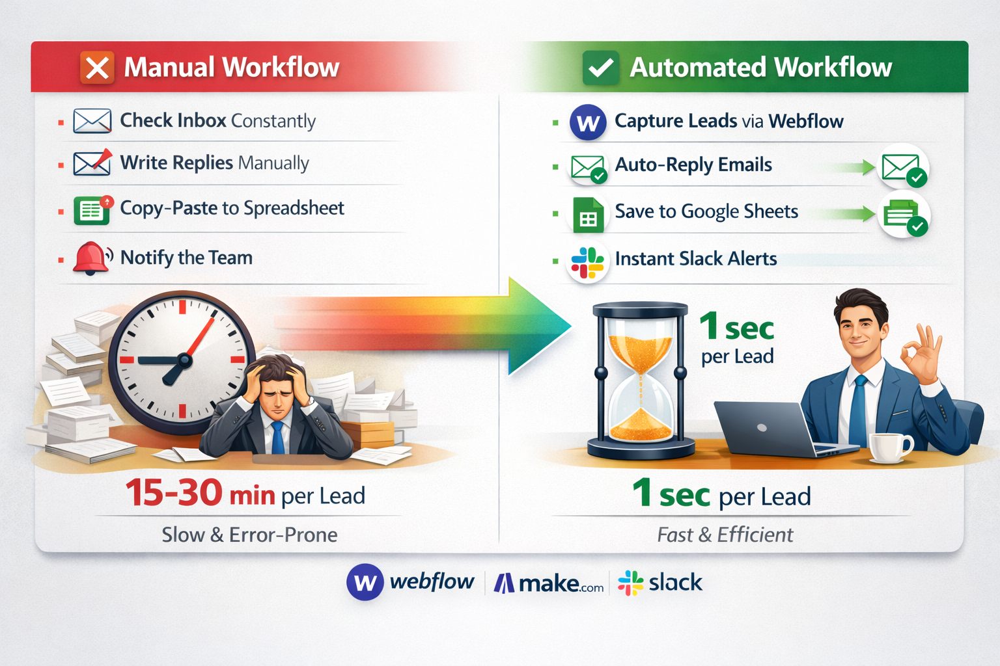

*Instant alerts. Centralized tracking. Peace of mind.*

---

###  Before vs. After

| ❌ Before (Manual)                  | ✅ After (Automated)                        |
|------------------------------------|--------------------------------------------|
| Leads buried in email inbox        | Leads instantly stored in Sheets           |
| Owner checks once a day            | Slack sends lead alert in real time        |
| Manual replies (or none at all)    | Auto-confirmation email in seconds         |
| No tracking system                 | Centralized lead log (timestamped)         |

> ⚠️ These are estimated results based on typical workflows of Swedish *småföretag* (small businesses).

---

##  What I’d Improve Next

- ➕ Add CRM integration (e.g. Notion or Airtable) to manage leads long-term  
- 🔁 Set up automated follow-up emails after 24h for unanswered leads  
- 📈 Create a basic analytics dashboard to track conversion rates  
- 💰 Connect to Fortnox for invoicing (for Swedish businesses)

---

##  Key Implementation Details (Behind the Scenes)

### 1) Parsing from Webflow email notification
Webflow sends all fields inside one email text block.  
I used **Text parser → Match pattern** with named groups to extract structured values:
- `name`
- `email`
- `message`

### 2) Reliable storage in Google Sheets
- Headers must be in **Row 1**
- If sheet columns change, refresh fields in the Make module
- `Source` is a fixed label (ex: `Webflow Contact Form`) for reusability across projects

### 3) Slack alert formatting
The Slack message includes key lead details for quick scanning:
- Name
- Email
- Message (short)

### 4) Auto-reply email
A short, professional confirmation message:
- acknowledges receipt
- sets response expectations (ex: “within 24 hours”)
- includes the original message for clarity

---

##  Notes on Privacy

All screenshots in this repository have **emails, tokens, and personal information blurred** to ensure privacy and simulate realistic business data safely.

---

## Tech Stack

- Webflow (Contact Form)
- Make.com (Scenario automation)
- Google Sheets
- Slack
- Email (SMTP/IMAP connection)

---

##  Call to Action

Looking to automate your lead handling or admin workflows?

I'm available for freelance projects, internships, or collaborations in automation, especially with tools like Webflow, Make.com, and Google Sheets.

👉 Let’s connect on [LinkedIn](https://www.linkedin.com/in/your-profile) or email me at **yourname@email.com**.

